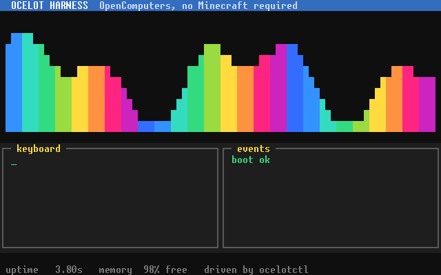

# Ocelot Harness

Run OpenComputers machines without Minecraft, and drive them from the command line, scripts, or an AI agent.



*Recorded by the harness itself: every keystroke and click above was sent through the protocol, and every frame is an exact screen capture. See [examples/showcase](examples/showcase/).*

Ocelot Harness wraps [ocelot-brain](https://gitlab.com/cc-ru/ocelot/ocelot-brain), the same emulator core behind Ocelot Desktop, in a headless daemon. You describe your computers in a project file (or import an existing Ocelot Desktop workspace), start them up, and then type, click, read the screen, take screenshots, and step the clock, all from a terminal. There's also a live viewer window if you want to watch.

## Why?

Ocelot Desktop is a great OC emulator, but it's built for a person at a mouse. There's no way to script it, run it headless, or let a program drive it. That means you can't write automated tests for OC software, and an AI agent can't write Lua, run it, look at the screen, and fix its own bugs.

Ocelot Harness takes the same emulator core and gives it a remote control. Anything that can run a command can now boot a computer, type into it, and read back exactly what's on screen.

It's handy for:

- testing OC programs automatically instead of clicking through them by hand
- letting an AI agent write, run, and debug Lua on real OC hardware
- reproducing bugs with saved snapshots
- running multi-computer setups (racks, servers, networks) on your desktop

## What it can do

- **Build machines**: cases, screens, keyboards, racks and servers, disk drives and floppies, RAID, holograms, note blocks, microcontrollers, relays, and cables, with real component inventories (CPUs, RAM, GPUs, EEPROMs, cards).
- **Use your files as disks**: point a managed disk at a folder on your PC and edit your Lua in your normal editor.
- **Import Ocelot Desktop workspaces** without touching the original.
- **Control input**: keys, typed text, paste, touch, drag, drop, and scroll.
- **Read output**: screen text, exact cells and colors, PNG screenshots, and events.
- **Control time**: run at 1–1000 TPS, pause, single-step, or run until text appears on screen.
- **Save and restore snapshots** of the whole workspace.
- **Watch live** in the viewer while scripts or agents drive the same session.

## Download

Grab the latest [Windows or Linux release](https://github.com/Renno231/ocelot-harness/releases/latest). Each download comes with its own Java (pick the Java 21 one if unsure), so there's nothing else to install. If you already have Java, it uses that instead.

Extract the whole archive, then follow the [download quick start](docs/downloads.md).

## Quick start

From the extracted folder on Windows (Linux uses `bin/ocelotctl` and so on):

```powershell
.\bin\ocelotctl.cmd project init ..\demo --template single-computer
.\bin\ocelot-harnessd.cmd up --project ..\demo
.\bin\ocelotctl.cmd --project ..\demo machine start main
.\bin\ocelot-viewer.cmd --project ..\demo
```

Other templates: `two-computers`, `rack-server`, and `mixed-network`.

Then poke at it from the command line:

```powershell
.\bin\ocelotctl.cmd --project ..\demo screen read main-screen
.\bin\ocelotctl.cmd --project ..\demo screen type main-screen "ls"
.\bin\ocelotctl.cmd --project ..\demo screen capture main-screen --format png
.\bin\ocelotctl.cmd --project ..\demo simulation pause
```

Stop it when you're done:

```powershell
.\bin\ocelot-harnessd.cmd down --project ..\demo
```

## Docs

- [CLI reference](docs/reference/cli.md): every command
- [Project file format](docs/reference/manifest-v2.md): devices, inventories, and connections
- [Importing Ocelot Desktop workspaces](docs/reference/desktop-import.md)
- [Live viewer](docs/reference/viewer.md)
- [Showcase example](examples/showcase/) (the demo above) and [two-computer example](examples/two-computers/)
- [All docs](docs/README.md)

Scripts and agents can also talk to the daemon directly over JSON-RPC (stdio or local socket). See the [architecture doc](docs/architecture/phase-1.md) for how it works.

## Building from source

You need a Java 8, 17, or 21 JDK.

```bash
git submodule update --init --recursive
scripts/verify
```

On Windows, use `scripts\verify.cmd`. When running from source, the same commands live in `scripts/` instead of `bin/`. See [CONTRIBUTING.md](CONTRIBUTING.md) for the rest.

## Related

[OC Robot Accelerator](https://github.com/Renno231/oc-robot-accelerator) runs real OpenComputers robot programs in sped-up Minecraft 1.12.2 worlds. It's a separate project.

## License

MIT. See [LICENSE](LICENSE). ocelot-brain and the bundled Java keep their own licenses; see [THIRD_PARTY_NOTICES.md](THIRD_PARTY_NOTICES.md).
